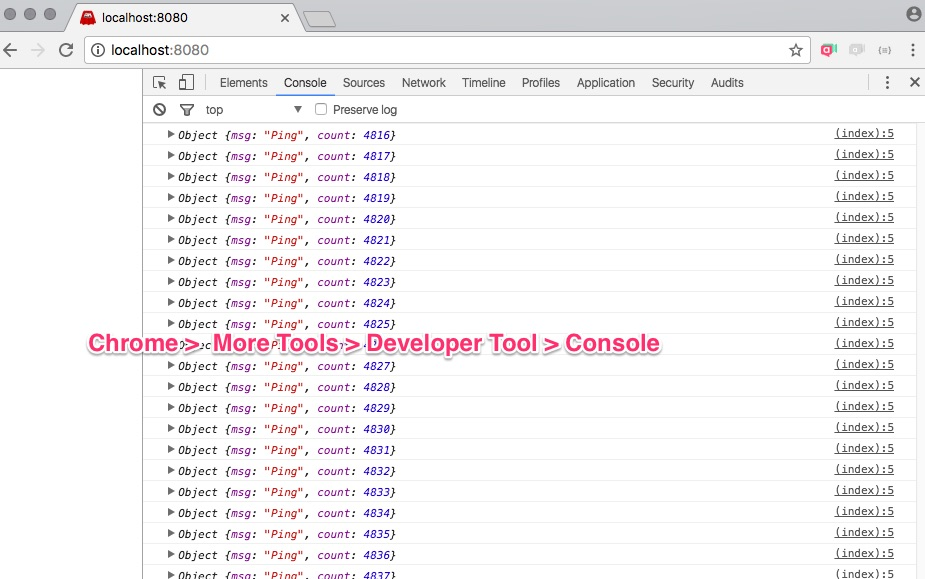

# Ứng dụng đơn giản Socket.io

## Chạy thử ứng dụng đơn giản nhất

Gõ URL http://localhost:8080, sau đó mở Developer Tool > Console ra coi
```bash
node simple.js
```

## Ứng dụng ping pong
```bash
node ping.js
```


## Ứng dụng chat

```bash
node chat.js
```